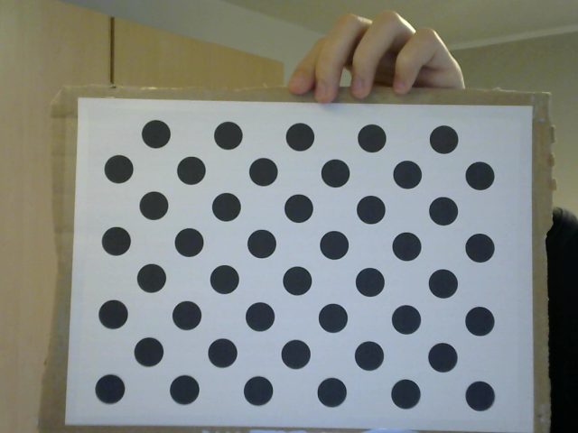

# Kamera-Kalibrierung mit OpenCV
Michael Froschauer - 2410454009

## Implementierung der Kamera-Kalibrierung

Die Kamera-Kalibrierung soll mit OpenCV durchgeführt werden. Dabei wird ein Schachbrettmuster oder ein Kreisraster zur Kalibrierung verwendet. Ziel ist es, die intrinsischen, extrinsischen und Verzerrungsparameter der Kamera zu bestimmen und diese für eine spätere Bildkorrektur zu nutzen.

### Vorgehensweise

#### 1. Erfassen von Kalibrierungsbildern:

   - Bilder eines Schachbrettmusters wurden mit sowohl mit einer externen Webcam als auch mit der internet Notebook Webcam aufgenommen.
   - Tests wurden sowohl mit einem möglichst optimalen Testbild als auch mit einem absichtlich verzerrten Schachbrettmuster durchgeführt, um die Robustheit der Implementierung zu überprüfen.

<div style="display: flex; justify-content: center; gap: 20px;">
    <figure>
        
        <figcaption style="text-align: center;">Abbildung 1: Schachbrettmuster (optimal)</figcaption>
    </figure>
    <figure>
        
        <figcaption style="text-align: center;">Abbildung 2: Schachbrettmuster (verzerrt)</figcaption>
    </figure>
</div>

<div style="page-break-after: always;"></div>

#### 2. Erkennung des Musters:

   - Die Funktion `cv2.findChessboardCorners` wurde verwendet, um die Ecken des Schachbretts zu identifizieren.
   - Alternativ wurde `cv2.findCirclesGrid` für die Erkennung eines asymetrischen Kreisrasters getestet, jedoch leider ohne Erfolg, das Testbild wurde bei mir nie richtig erkannt.

<div style="display: flex; justify-content: center; gap: 20px;">
    <figure>
        
        <figcaption style="text-align: center;">Abbildung 3: Schachbrettmuster (optimal)</figcaption>
    </figure>
    <figure>
        
        <figcaption style="text-align: center;">Abbildung 4: Schachbrettmuster (verzerrt)</figcaption>
    </figure>
</div>

<figure>
     
     <figcaption style="">Abbildung 5: Asymmetrischer Kreisraster</figcaption>
 </figure>


#### 3. Berechnung der Kameraparameter:

   Mit der Funktion `cv2.calibrateCamera` wurden die folgenden Parameter berechnet:
   - **Kameramatrix (intrinsische Parameter)**: Diese beschreibt die inneren Eigenschaften der Kamera, wie die Brennweite und den optischen Mittelpunkt.
   - **Verzerrungskoeffizienten**: Diese Parameter modellieren die Verzerrung der Linse, insbesondere die radiale und tangentiale Verzerrung.
   - **Rotations- und Translationsvektoren (extrinsische Parameter)**: Diese beschreiben die Position und Orientierung der Kamera relativ zur Szene.

### Ergebnisse der Kalibrierung

Die Kamera-Kalibrierung war erfolgreich. Mehrere Bilder würden zu einer genaueren und robusteren Lösung führen, insbesondere für die Schätzung der intrinsischen Parameter (Kameramatrix & Verzerrungskoeffizienten). Die extrinsischen Parameter (Rotations- und Translationsvektoren) beziehen sich spezifisch auf dieses eine Bild, da sie sich für jedes Kalibrierungsbild individuell ändern. Um die Dokumentation kurz zu halten, werden hier jedoch nur die Ergebnisse eines einzelnen Bildes dargestellt.

*(Im Anhang befinden sich dann die Tests und Ergebnisse mit mehreren Bildern und verschiedenen Kameras.)*

#### 1. Kamerakalibierung für das optimale Bild:
Die berechneten Parameter sind für das optimale (nicht absichtlich verzerrte) Bild:    
**Root Mean Square Error (RMS):** 0.07838    
**Kameramatrix:**    
```
[[2223.97554          0.0   300.046808]
 [       0.0   2221.66388   217.340798]
 [       0.0          0.0          1.0]]
```

Die Kameramatrix gibt an, wie die Bildkoordinaten mit der realen Szene zusammenhängen. Sie enthält die Brennweitenwerte und den optischen Mittelpunkt.

**Erklärung der Werte:**
- **2223.97554** → Brennweite in Pixeln entlang der X-Achse  
- **2221.66388** → Brennweite in Pixeln entlang der Y-Achse  
- **300.046808** → X-Koordinate des optischen Zentrums (Bildmitte)  
- **217.340798** → Y-Koordinate des optischen Zentrums (Bildmitte)  

**Verzerrungskoeffizienten:**    
```
[[−1.14417139   87.2180354   0.00823849  0.0200677839  −1429.65366]]
```
Diese Koeffizienten beschreiben die Verzerrungseffekte der Linse. Ein hoher Wert zeigt eine starke Verzerrung an.

**Erklärung der Werte:**  
- **k_1 = -1.14417139** → Radialer Verzerrungskoeffizient (1. Ordnung)  
- **k_2 = 87.2180354** → Radialer Verzerrungskoeffizient (2. Ordnung)  
- **p_1 = 0.00823849** → Tangentialer Verzerrungskoeffizient (1. Ordnung)  
- **p_2 = 0.0200677839** → Tangentialer Verzerrungskoeffizient (2. Ordnung)  
- **k_3 = -1429.65366** → Radialer Verzerrungskoeffizient (3. Ordnung)  

**Radiale Verzerrung** (k_1, k_2, k_3) bewirkt tonnen- oder kissenförmige Verzerrungen, abhängig von der Linse.  
**Tangentiale Verzerrung** (p_1, p_2) tritt auf, wenn die Linse nicht perfekt zur Sensorebene ausgerichtet ist.  

**Extrinsische Parameter:**    
```
ROTATION:
[[0.04446572],
 [0.10787995],
 [1.68047612]]
 
TRANSLATION:
[[ 5.77632098],
 [-1.36478639],
 [64.30078254]]
```
Diese Parameter beschreiben die Lage der Kamera relativ zur aufgenommenen Szene.
- **Rotation (R)** → Gibt an, wie die Kamera im Raum (bzw. zum Schachbrettmuster) gedreht ist.  
- **Translation (T)** → Gibt an, wo die Kamera relativ zur Szene positioniert ist.  


#### 2. Kamerakalibierung für das bewusst verzerrte Bild:
Die berechneten Parameter sind für das verzerrte Bild:    
**Root Mean Square Error (RMS):** 0.422629    
**Kameramatrix:**    
```
[[1091.64418          0.0   338.472539]
 [       0.0   1045.04657   137.211886]
 [       0.0          0.0          1.0]]
```

Die Kameramatrix gibt an, wie die Bildkoordinaten mit der realen Szene zusammenhängen. Sie enthält die Brennweitenwerte und den optischen Mittelpunkt.

**Verzerrungskoeffizienten:**    
```
[[-1.08087431   4.43422984   0.14391658   0.0001976364   -17.9703324]]
```
Diese Koeffizienten beschreiben die Verzerrungseffekte der Linse. Ein hoher Wert zeigt eine starke Verzerrung an.

**Extrinsische Parameter:**    
```
ROTATION:
[[-0.07125479],
 [ 0.08315023],
 [ 1.59732734]]
 
TRANSLATION:
[[ 3.15585403],
 [ 1.93264747],
 [27.83891718]]
```
Diese Parameter beschreiben die Lage der Kamera relativ zur aufgenommenen Szene.

---

## Verzerrungskorrektur und Visualisierung

Mit den ermittelten Kalibrierungsergebnissen soll eine Verzerrungskorrektur angewendet werden. Zusätzlich soll eine Visualisierung der Verzerrung vor und nach der Korrektur erfolgen.

### Vorgehensweise

#### 1. Anwenden der Verzerrungskorrektur:

   - Mit der Funktion `cv2.undistort` wurde die Korrektur auf Testbilder angewendet.
   - Die korrigierten Bilder wurden gespeichert und angezeigt.

Die Verzerrungskorrektur konnte erfolgreich durchgeführt werden.

<div style="display: flex; justify-content: center; gap: 20px;">
    <figure>
        
        <figcaption style="text-align: center;">Abbildung 6: Schachbrettmuster (optimal) korrigiert</figcaption>
    </figure>
    <figure>
        
        <figcaption style="text-align: center;">Abbildung 7: Schachbrettmuster (verzerrt) korrigiert </figcaption>
    </figure>
</div>

#### 2. Visualisierung der Verzerrung:

   - Ein Vektorfeld wurde zur Darstellung der Verzerrung vor der Korrektur genutzt.
   - Die Funktion `cv2.initUndistortRectifyMap` wurde verwendet, um eine Mapping-Tabelle für die Pixelverschiebung zu erstellen.
   - Die Verschiebung der Pixel wurde mit roten Pfeilen auf dem Originalbild dargestellt.

Die Visualisierung mit einem Vektorfeld zeigt deutlich, wie stark die Verzerrung vor der Korrektur war und welche Bereiche besonders betroffen sind.

<div style="display: flex; justify-content: center; gap: 20px;">
    <figure>
        
        <figcaption style="text-align: center;">Abbildung 8: Schachbrettmuster (optimal) Vektorfeld</figcaption>
    </figure>
    <figure>
        
        <figcaption style="text-align: center;">Abbildung 9: Schachbrettmuster (verzerrt) Vektorfeld </figcaption>
    </figure>
</div>


## Anmerkung Tests
Im ZIP-Anhang befinden sich neben der Implementierung vier Testläufe, die jeweils ein optimales Testbild (Schachbrettmuster) und ein absichtlich verzerrtes Testbild beinhalten. Diese Tests wurden mit zwei verschiedenen Kameras durchgeführt: der internen Laptop-Webcam und einer externen Webcam. In jedem Ordner ist außerdem eine Datei namens „results.txt“ enthalten, die die berechneten Kamerakalibrierungswerte für jeden Testlauf dokumentiert.
